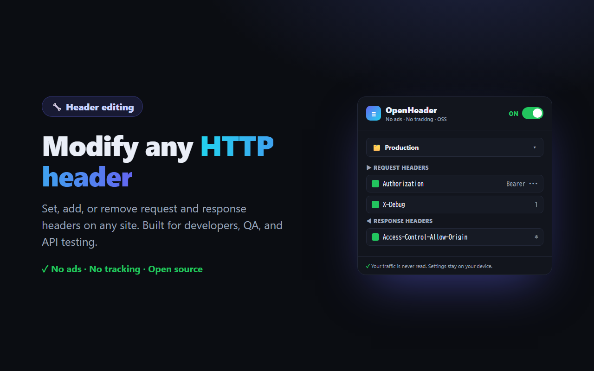
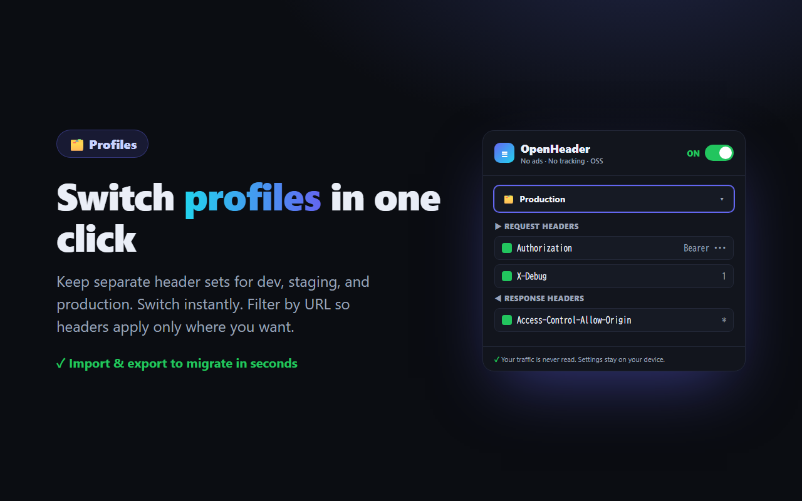
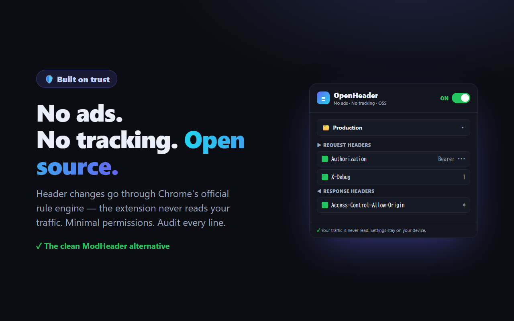

# OpenHeader — HTTP Header Editor

A clean, open-source Chrome extension to **add, modify, and remove HTTP request & response headers**.
Built for developers, QA, and API testing — with **no ads, no tracking, and minimal permissions**.

> A safe, transparent alternative to header editors that inject ads or bundle tracking SDKs.

> ✅ **Now available on the [Chrome Web Store](https://chromewebstore.google.com/detail/openheader-%E2%80%94-http-header/aeabnpbnofhlnphkfmfjoolfheljpnkg).** One-click install — or load it unpacked from source (see [Install](#install)).

## Features
- Add / set / remove **request** headers
- Add / set / remove **response** headers
- **Profiles** — switch between header sets in one click
- **Per-profile URL filter** — apply headers only to specific sites
- **Import / export** your settings
- Master on/off toggle

## Privacy & trust
OpenHeader **never reads or transmits your traffic.**
Header modifications are applied through Chrome's official [`declarativeNetRequest`](https://developer.chrome.com/docs/extensions/reference/api/declarativeNetRequest) rule engine — the extension itself does not intercept or inspect network requests.

- No analytics. No trackers. No advertising SDKs.
- Your header configurations are stored **locally** in your browser (`chrome.storage.local`) and are never sent anywhere.

### Permissions
| Permission | Why |
|---|---|
| `declarativeNetRequest` | Apply your header rules via Chrome's official engine |
| `storage` | Save your header rules/profiles locally |
| `host_permissions: <all_urls>` | Let your headers apply to whatever site/API you're working on (you can restrict per profile with a URL filter). No page content is read. |

|  |  |
|---|---|
|  |  |

## Install
**From the Chrome Web Store (recommended):**
👉 **[Add OpenHeader to Chrome](https://chromewebstore.google.com/detail/openheader-%E2%80%94-http-header/aeabnpbnofhlnphkfmfjoolfheljpnkg)**

**From source (developer mode):**
1. [Download this repo as a ZIP](https://github.com/smartfabai-commits/openheader/archive/refs/heads/main.zip) and unzip it (or `git clone`).
2. Open `chrome://extensions` and enable **Developer mode** (top right).
3. Click **Load unpacked** and select the folder.

## Usage
1. Click the OpenHeader icon.
2. Add a request or response header (name + value).
3. Turn the master switch **ON**.
4. Verify at e.g. `https://httpbingo.org/headers`.

## Contributing
Issues and PRs welcome. The goal is to stay small, fast, and trustworthy.

## License
[MIT](./LICENSE)
